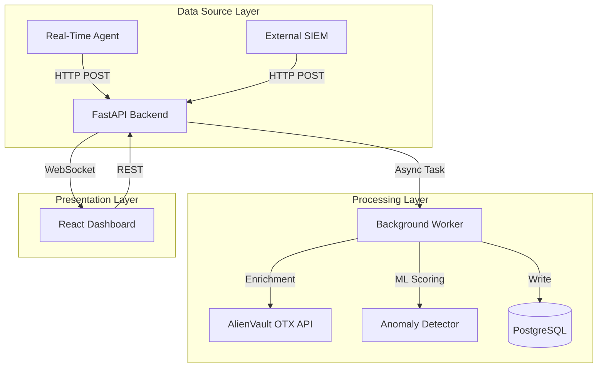

# 🛡️ SOCGuard - Real-Time Threat Detection Dashboard

A modernized, full-stack Security Operations Center (SOC) dashboard capable of **ingesting, analyzing, and visualizing security events in real-time**. 

Built with **FastAPI (Async Python)**, **React**, **PostgreSQL**, and **Docker**, this system simulates an enterprise-grade threat detection pipeline. It features an integrated **SIEM agent** that monitors live system logs, network traffic, and process creation to detect suspicious activity.


---

## 🏗️ System Architecture

The system follows a microservices-inspired architecture, separating the ingestion/analysis layer from the presentation layer.



## 🚀 Key Features

- **Real-Time Data Ingestion**: High-throughput `/api/ingest` endpoint receiving JSON logs from distributed agents.
- **Live Threat Detection Agent**: Custom Python agent (`real_time_agent.py`) that monitors:
    - 🔴 **Windows System Logs** (via `pywin32`)
    - 🌐 **New Network Connections** (via `psutil`)
    - ⚙️ **Suspicious Process Creation** (via `psutil`)
- **Automated Enrichment**: Automatically queries **AlienVault OTX** to check IP reputation and tags (e.g., "Malware", "Scanning").
- **Dynamic Risk Scoring**: Events are scored (0.0 - 1.0) based on rules and ML-lite heuristics. High scores trigger alerts.
- **Enterprise-Grade Security (Audit Complete)**:
    - 🔐 **RBAC**: Multi-role access control (Admin, Analyst, Read-only).
    - 🛡️ **Rate Limiting**: Brute-force protection on authentication endpoints.
    - 🧱 **Security Headers**: HSTS, CSP, and Frame protection enabled.
    - �️ **IDOR Protection**: Strict alert-to-analyst assignment verification.
- **Case Management**: Assign alerts to analysts, add comments, and track investigation status.
- **Automated Response**: One-click actions (e.g., "Block IP") directly from the UI.

## 🛠️ Tech Stack

- **Backend**: Python 3.11, FastAPI, SQLAlchemy (Async), Pydantic
- **Frontend**: React 19, Vite 7, TailwindCSS 4, Recharts, React-Simple-Maps
- **Database**: PostgreSQL & Redis (Status/Rate Limiting)
- **Infrastructure**: Docker, Kubernetes, Docker Compose
- **External APIs**: AlienVault OTX

## ⚡ Getting Started

### Prerequisites
- Docker & Docker Compose
- Python 3.11+ (for local agent)

### 1. Run the Platform (Docker)
The easiest way to start the backend, database, and frontend.
```bash
# Create .env file with your API keys (see .env.example)
cp .env.example .env

# Start services
docker-compose up --build
```
> The Dashboard will be available at `http://localhost:5173`.
> The API Docs (Swagger) will be at `http://localhost:8000/docs`.

### 2. Run the Real-Time Agent
To start monitoring your local machine and feeding data into the dashboard:
```bash
# Install dependencies
pip install -r requirements.txt

# Run the agent
python real_time_agent.py
```
*Note: Requires Admin/Root privileges to read system event logs.*

### 3. Cloud Deployment (Kubernetes)
The project includes standard Kubernetes manifests for deployment to AWS EKS, Google GKE, or Azure AKS.

```bash
# Apply infrastructure (Postgres, Redis, Secrets)
kubectl apply -f kubernetes/infrastructure.yaml

# Deploy Backend API, Worker Nodes, and Frontend
kubectl apply -f kubernetes/application.yaml
```

## 🔒 Production Considerations

This project serves as a **High-Fidelity MVP**. For enterprise production deployment, the following enhancements are recommended:

### Security Hardening
- **Authentication**: Replace Basic Auth/OAuth mock with a centralized IdP (Okta/Auth0).
- **Secrets Management**: Move `.env` secrets (DB credentials, API keys) to HashiCorp Vault or AWS Secrets Manager.
- **Traffic Encryption**: Terminate SSL/TLS at a reverse proxy (Nginx/Traefik) before hitting the API.
- **Input Validation**: Enforce strict schemas on log ingestion to prevent injection attacks.

### Scalability Roadmap
To scale from **100 EPS** (Events Per Second) to **10,000+ EPS**:
1.  **Message Queue**: Introduce **Kafka** or **RabbitMQ** between the Ingestion API and Workers to buffer bursts.
2.  **Database sharding**: Partition PostgreSQL tables by time (TimeScaleDB) to handle millions of rows.
3.  **Horizontal Scaling**: Deploy the API behind a Load Balancer (AWS ALB) and scale worker nodes dynamically (Kubernetes HPA).
4.  **Caching**: Aggressively cache enrichment data in Redis to reduce external API latency.

## 🔒 Security Audit & Walkthrough

A professional-grade security audit was conducted on this codebase. You can find the detailed findings and implementation details in the [Walkthrough](file:///C:/Users/adith/.gemini/antigravity/brain/463eb236-8b9f-4631-9add-5f93e57e4575/walkthrough.md).

### Implemented Measures:
- **A01: Broken Access Control**: Implemented IDOR checks and RBAC.
- **A04 & A07**: Redis-based rate limiting to prevent authentication brute-forcing.
- **A05: Security Misconfiguration**: Configurable CORS and global security headers.
- **Secrets Management**: Sanitized manifests and environment variable configuration via `.env.example`.

## 🧪 Testing

Run the integration test suite to verify the pipeline:
```bash
pytest tests/
```
